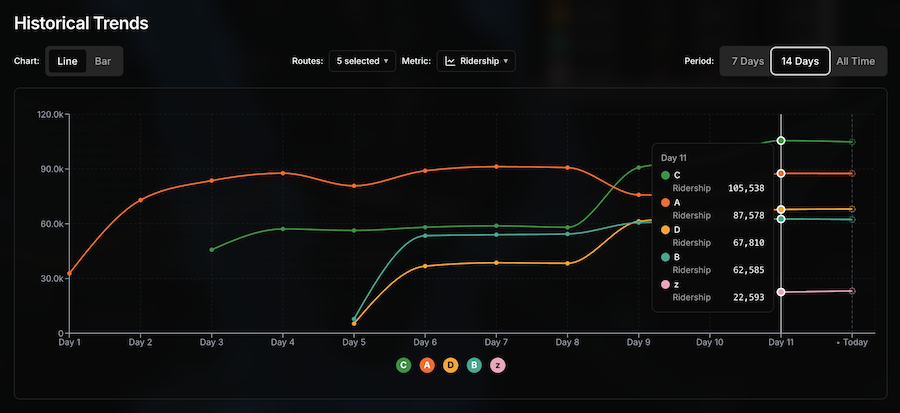
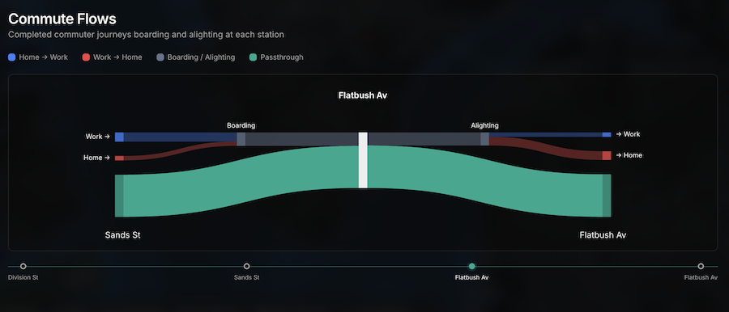
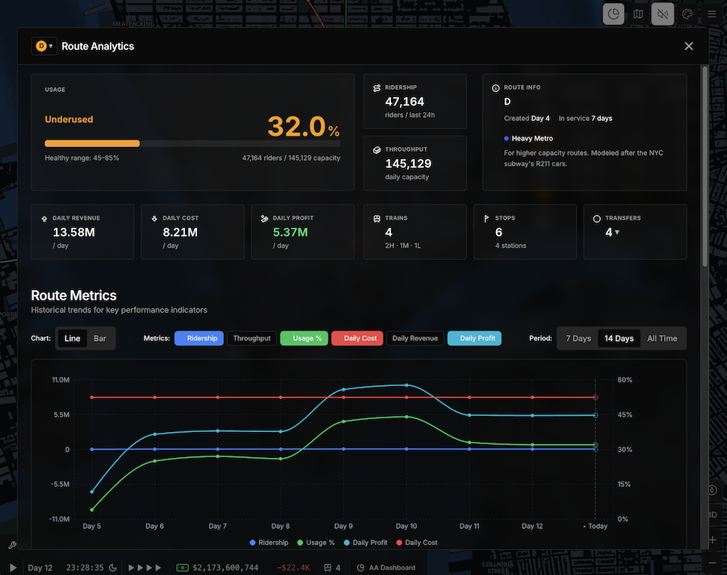

# Advanced Analytics

A mod for [Subway Builder](https://www.subwaybuilder.com) that adds detailed per-route analytics, historical tracking, and financial metrics to your network.

---

## What it does

Advanced Analytics sits alongside the game UI and gives you data the base game doesn't expose:

- **Per-route metrics** — ridership, throughput, capacity usage, transfer connections, revenue, cost, profit, and profit per train
- **Three data modes** — live (last 24h), historical (end-of-day snapshots), and side-by-side day comparison
- **Trend charts** — visualize how any route evolved over time
- **System map** — schematic overview of your entire network
- **Storage manager** — export, import, and manage analytics data across saves

All data is stored in IndexedDB and persists across game restarts. No save file is modified.

---

## Download

Pre-releases may contain incomplete features or bugs. Use stable builds for everyday play.

---

## Installation

1. Download the ZIP from the release page.
2. Extract the `advanced_analytics/` folder into your mods directory:
    - **Windows:** `%APPDATA%\SubwayBuilder\mods\`
    - **macOS:** `~/Library/Application Support/SubwayBuilder/mods/`
    - **Linux:** `~/.config/SubwayBuilder/mods/`
3. Launch Subway Builder. The mod loads automatically.

---

## Contributing

Bug reports and feature suggestions are welcome.

- **Found a bug?** [Open an issue](https://github.com/stefanorigano/advanced_analytics/issues/new) with steps to reproduce and your game version.
- **Have an idea?** Open an issue to discuss it before sending a PR.
- **Want to contribute code?** Fork the repo, make your changes on a branch, and open a pull request against `master`. Please keep PRs focused — one feature or fix per PR.

### Useful Links

|                             |                                                               |
|-----------------------------|---------------------------------------------------------------|
| 🚇 Subway Builder           | [subwaybuilder.com](https://www.subwaybuilder.com)            |
| 📖 Official API docs        | [subwaybuilder.com/docs](https://www.subwaybuilder.com/docs/) |
| 💬 Community Modding  | _[subwaybuildermodded.com](https://subwaybuildermodded.com/)_ |

---

## Thank you

A big thank you to everyone who tested early builds, reported bugs, and shared feedback. This mod wouldn't be where it is without your support. ❤️

---

## License

